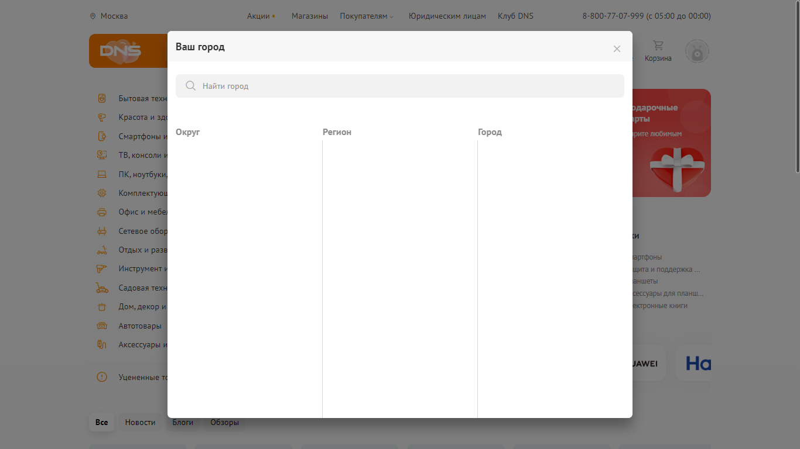

# Тестовое задание для DNS

## Объём тестирования

Реализованы UI-автотесты, которые осуществляют проверку корректной работы функциональности выбора города на сайте https://www.dns-shop.ru

[Полный текст задания](https://github.com/albinamv/DNSCitySelectorTest/tree/main/Task)

* Запуск автотестов осуществляется в браузерах Chrome и Firefox (без Opera, согласно [документации Selenium](https://www.selenium.dev/documentation/webdriver/getting_started/install_drivers/), драйвер для Opera больше не поддерживается)
* Параллельный запуск тестов реализован с помощью аннотации NUnit [Parallelizable].
* Тесты запускаются для разрешения 1920*1080 px. Тесты для других разрешений не реализованы ввиду ограничений времени на выполнение работы.

## Перечень тестов

### Чек-лист позитивных проверок для выбора города

1. Через поиск, корректное значение с заглавной буквы
2. Через поиск, корретное значение в нижнем регистре
3. Через поиск, корректное значение в верхнем регистре
4. Через поиск, неполное название города
5. Через поиск, название города на англ. раскладке
6. Через список городов под полем для поиска
7. Через список округов и областей

### Чек-лист негативных проверок

8. Ввод цифр в поле для поиска города
9. Ввод спец. символов и знаков пунктуации (кроме дефиса) в поле для поиска города
10. Ввод только пробелов в поле для поиска города

## Сложности в ходе выполнения задания

1. Отсуствие поддержки драйвера для Opera
2. При многократном выполнении автотестов происходит временная "блокировка" модуля для выбора города — при загрузке модального окна не подгружаются списки городов, областей, округов. Из-за этого тесты могут падать, т.к. не получается найти нужные элементы в течение заданного времени. Решается подключением к другой сети.
